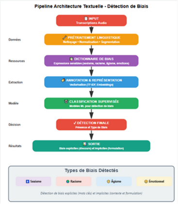
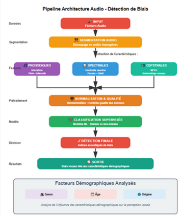
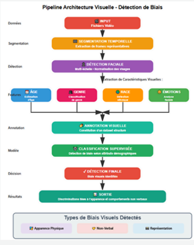
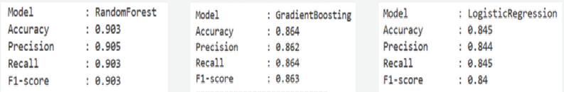
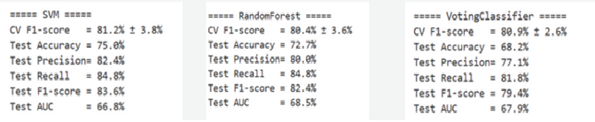
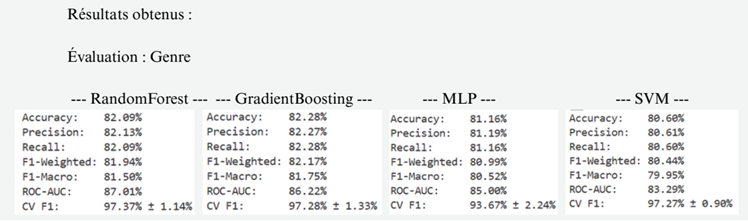
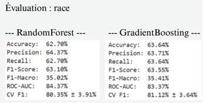
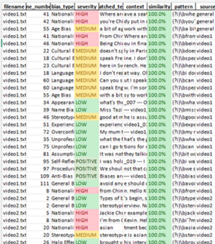
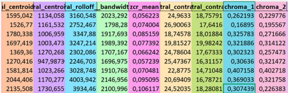
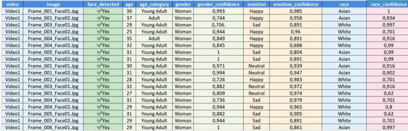

# 🎥 Détection Automatique des Biais dans les Entretiens Vidéo par IA  
### Projet de Fin d’Études – Master Big Data & Data Science  
**Université Hassan II – FS Ben M’Sik | 2024–2025**

---

## 📌 Présentation du Projet

Les systèmes automatisés d’évaluation des entretiens vidéo sont de plus en plus utilisés dans les processus de recrutement.  
Cependant, ces systèmes peuvent involontairement introduire ou amplifier des **biais algorithmiques** liés au genre, à la race ou au langage.

Ce projet propose un **système multimodal basé sur l’intelligence artificielle** pour détecter les biais potentiels dans les entretiens vidéo, à travers l’analyse conjointe de :

- 📝 **Texte** (transcription et analyse linguistique)  
- 🔊 **Audio** (caractéristiques prosodiques et spectrales)  
- 🖼️ **Image / Vidéo** (attributs faciaux et indices visuels)

L’objectif est d’**évaluer l’équité**, d’identifier les biais et de comparer l’efficacité de chaque modalité.

---

## 🏗️ Architecture du Système

Le système est composé de trois pipelines de traitement indépendants.

### 🔹 1. Pipeline de Traitement du Texte
Ce pipeline vise à détecter les **biais linguistiques** à partir des transcriptions des entretiens.

**Étapes principales :**
- Transcription audio → texte  
- Nettoyage et normalisation du texte  
- Extraction de caractéristiques liées aux biais  
- Vectorisation (TF-IDF / embeddings)  
- Classification  

---

### 🔹 2. Pipeline de Traitement Audio
Le pipeline audio permet de capturer des **indices prosodiques et acoustiques** pouvant révéler des biais implicites.

**Caractéristiques extraites :**
- Pitch, énergie, pauses  
- Coefficients MFCC  
- Caractéristiques spectrales  

---

### 🔹 3. Pipeline Image / Vidéo
Ce pipeline analyse les aspects visuels susceptibles d’introduire des biais démographiques.

**Étapes principales :**
- Extraction des frames  
- Détection des visages  
- Estimation démographique (âge, genre, race)  
- Analyse des émotions  

---

## 📊 Résultats Expérimentaux

### 🔹 Résultats – Modalité Texte
Les modèles basés sur le texte obtiennent les **meilleures performances**, montrant l’importance du langage dans la détection des biais.

---

### 🔹 Résultats – Modalité Audio
L’analyse audio permet de détecter des variations prosodiques subtiles associées à des biais implicites.

---

### 🔹 Résultats – Modalité Image / Vidéo
Les caractéristiques visuelles mettent en évidence des **disparités démographiques** entre différents groupes.

---

## 📂 Exemples de Données Utilisées

### 📝 Jeu de Données Texte
Contient des phrases d’entretiens annotées selon le type de biais, le niveau de sévérité et des caractéristiques linguistiques.

---

### 🔊 Jeu de Données Audio
Inclut des caractéristiques acoustiques extraites pour chaque segment audio.

---

### 🖼️ Jeu de Données Image
Contient des attributs faciaux avec des scores de confiance.

---

## 🎯 Objectifs du Projet

- Détecter et quantifier les biais dans les systèmes d’entretien automatisés  
- Concevoir des pipelines multimodaux indépendants  
- Extraire des caractéristiques pertinentes (linguistiques, audio, visuelles)  
- Évaluer l’équité entre différents groupes démographiques  
- Comparer l’impact de chaque modalité  

---

## 🧪 Technologies Utilisées

**Base :**  
- Python, Scikit-learn  

**Traitement du Langage Naturel (NLP) :**  
- Whisper, HuggingFace Transformers  

**Traitement Audio :**  
- Librosa  

**Vision par Ordinateur :**  
- OpenCV, MTCNN, DeepFace  

---

## 🏁 Principaux Résultats

- 🥇 La modalité texte offre les meilleures performances globales  
- 🔊 L’audio permet de capter des indices de biais implicites  
- 🖼️ L’analyse visuelle révèle des déséquilibres démographiques  
- ⚖️ Les métriques d’équité montrent des disparités entre groupes  

---

## 🚀 Travaux Futurs

- Fusion multimodale des trois pipelines  
- Utilisation de jeux de données réels issus des RH  
- Techniques d’adversarial debiasing  
- Tableau de bord interactif pour l’évaluation de l’équité  

---

## 👩‍💻 Auteure

**Hajar Boutayeb**  
📧 Email : hajarboutayeb3@gmail.com  
🔗 LinkedIn : https://www.linkedin.com/in/hajar-boutayeb-25bb90303/

---
